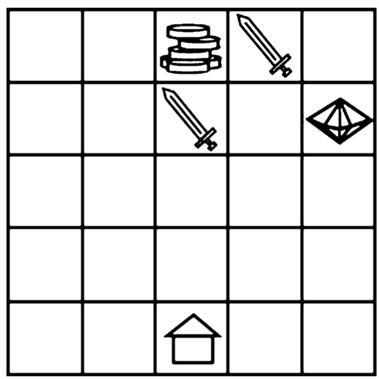
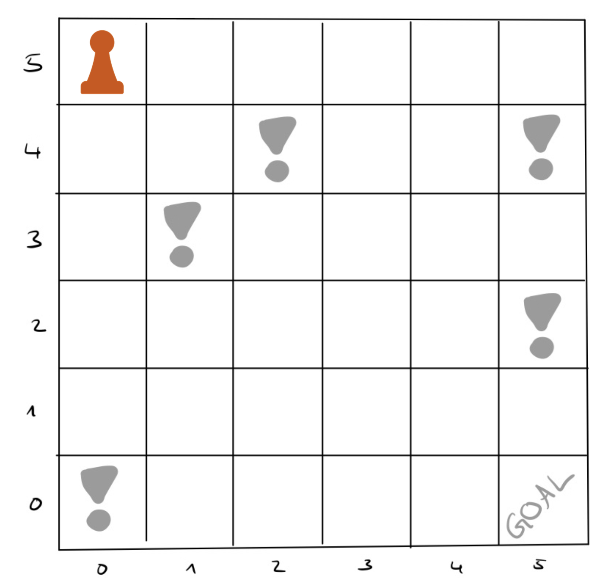
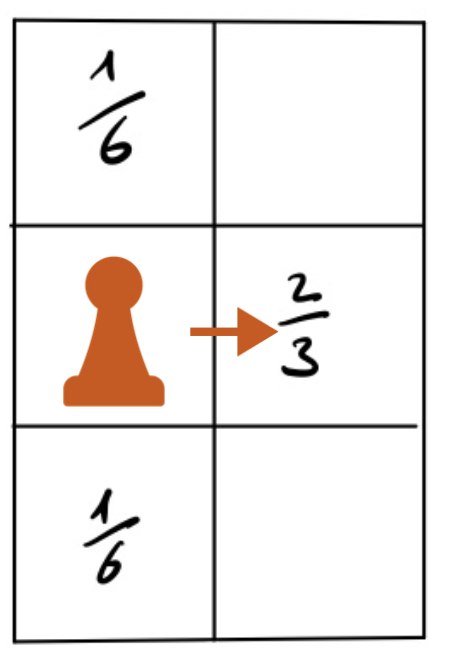

# Reinforcement Learning for Markov Decision Processes
This is the Documentation for the Code by Vlad and Elisabeth for the Practical Course "Recent Advances in Model Checking" under the supervision of Stefanie Mohr.

Some definitions:\
episode = one run through the model until the objective of the model is fulfilled (e.g. the goal is reached)\
step = one execution of an action within the model

## Overview
### Introduction
This project examines how well reinforcement learning for decision trees can be applied to model checking.
The goal is to learn a near optimal policy in the form of a decision tree for a given [Markov Decision Process](https://en.wikipedia.org/wiki/Markov_decision_process).
To investigate this we reimplemented two approaches that have been published in the field of traditional Machine Learning:
1. "Decision Tree Function Approximation in Reinforcement Learning" by Larry D. Pyeatt and Adele E. Howe, published in 1998 - *The old algorithm*
2. "Conservative Q-Improvement: Reinforcement Learning for an Interpretable Decision-Tree Policy" by Aaron M. Roth, Nicholay Topin, Pooyan Jamshidi and Manuela Veloso, published in 2019 - *The CQI algorithm*

We applied the algorithms to two different JANI models.
Our results show that both algorithms almost always learn a near optimal decision tree policy under well-chosen parameters and thus these algorithms can be applied to model checking. We did not observe a big difference in performance of these two approaches.

### Functionality
Given a Markov Decision Process modeled with the JANI format, our tool can perform the two algorithms and output a decision tree policy. For a detailed description on how to run it please refer to section [Getting Started](#getting-started).\
This Project also contains a Jupyter Notebook with a description of our tests to compare the two, the scripts to replicate them as well as plots which show the results. For more details please refer to section [Results](#results).

### Results
We compared the two algorithms in terms of immediate reward and tree size during and after training. The resulting graphs and their origins are documented inside the jupyter notebook `Simulations_Model_Checking.ipynb`.

To display and run the jupyter notebook you need to install jupyter. You can do so using [pip](https://pip.pypa.io/en/stable/installation/):

    $ pip install notebook

For alternative ways to install jupyter notebook please refer to the official [documentation](https://jupyter.org/install).

Next, navigate to `src/Testing/Simulations` and run

    $ jupyter notebook Simulations_Model_Checking.ipynb

This should open a new tab in your default browser and display the notebook.
  
## Getting Started
### Prerequisites
#### Momba
[Momba](https://momba.dev/) descibes itself as "a Python framework for dealing with quantitative models centered around the JANI-model interchange format".
We use it to perform steps within a JANI model and extract information about the current state as well as possible actions.
Momba can be conviniently installed by running:

    $ pip install momba

For further details please refer to the official momba [setup guide](https://momba.dev/#getting-started) or [user guide](https://momba.dev/guide/).

#### Other Requirements
The Code is written in [Python 3](https://www.python.org/downloads/) and has been tested with Python 3.9.0 and 3.10.0.\
Apart from momba we are also using the following dependencies:
- [random](https://docs.python.org/3/library/random.html)
- [numpy](https://numpy.org/)
- [graphviz](https://graphviz.org/)
- [pathlib](https://docs.python.org/3/library/pathlib.html)
- [json](https://www.json.org/json-de.html)
- [operator](https://docs.python.org/3/library/operator.html)
- [scipy](https://scipy.org/)
- [math](https://docs.python.org/3/library/math.html)
- [warnings](https://docs.python.org/3/library/warnings.html)
- [abc](https://docs.python.org/3/library/abc.html)

### Testing your setup
Navigate into the `src/Implementation` folder and run `algorithms.py`.\
You should see something like this continuously running in your terminal:

    Episode 1
    Episode 2
    ...

This means the default algorithm run has successfully started. This will take some time as the algorithm will likely need than 2000 Episodes to finish.\
For the interpretation of the output please refer to section [Interpretation of Output](#interpretation-of-output).

## Recreating our Tests
This code was tested on two distinct problems which are modeled as Markov decision processes:
1. The Resource Gathering problem
2. The Frozen Lake Problem

To fully understand the purpose and performance of the algorithms it is important to understand the given problems and their objectives.
If you are less interested in the "why" and more in the "how" feel free to jump to section [Running the Algorithm](#running-the-algorithm).

### Recourse Gathering
We are given a grid environment with a home tile, a gem tile, a gold tile and any number of enemy tiles.
We use the same layout as the original problem that was proposed in [Empirical evaluation methods for multiobjective reinforcement learning algorithms](https://link.springer.com/article/10.1007/s10994-010-5232-5):\
 

The coordinates start at (1,1) in the bottom left corner and go up to (5,5) in the top left corner.
The home tile is located at (3,1), gold at (3,5), gem at (5,4) and we are facing two enemies at (3,4) and (4,5).

We start at our home and it is our objective to go to the gold/gem tile to pick up gold/gem and collect it by bringing it back home.
It is not possible to carry more than one piece of each at the same time, however it is possible to carry one gold and one gem simultaneously.
At any given moment we have four possible actions: left, right, up and down. If executing an action would cause us to leave the grid, the execution of this action has no effect. This means we can choose any action at all times.
There are enemies which attack the player with some fixed probability if the player is on the enemy time or on one of the four tiles directly adjacent to the enemy tile. 

The amount of gems and gold to collect is specified in the JANI model and can be adapted to make the problem harder or simpler (see Appendix: [Adapting Existing Models](#adapting-existing-models)). We are using a relatively complex setup with 5 gold and 3 gems to collect.

### Frozen Lake Problem
We are given a grid environment with a start and an end tile. The goal is to navigate from start to finish in as few steps as possible. On arbitrary other tiles there are holes in the ice which should be avoided.\
The actions are to go east, west, north or south. We can never move outside the given grid though.

We are using the following layout with the coordinates as indicated in the picture. The start is at (0,5) and the goal is to reach (5,0) without stepping on one of the tiles marked dangerous.\


What makes this problem more complicated than others is that there is only one reward when the goal is reached and that there is a high level of randomness.\
When choosing an action there is only a 2/3 chance to actually go where intended. There is a 1/6 chance to end up on the tiles at 90° to the sides of the intended action. The illustration below shows this phenomenon:\


### Running the Algorithm
To run the algorithms you need to call the functions CQI or Old_Algorithm which are inside the file `src/Implementation/algorithms.py`.\
Simply navigate to the `Implementation` folder and run `algorithms.py` with python 3. 
The default function call that is executed by this is:

    CQI("../Testing/models/resources_parsed_fully.jani")

This calls the Conservative Q Improvement algorithm from the new paper.
To change to the old algorithm simply *comment out* the `CQI` function call and *comment in* the `Old_Alg` function call:

    # CQI("../Testing/models/resources_parsed_fully.jani")
    Old_Alg("../Testing/models/resources_parsed_fully.jani")

Both of these will run the respective algorithm on the [Resource Gathering](#resource-gathering) Problem. 

### Switching Model
To switch to the [Frozen Lake](#frozen-lake-problem) model you need to change 3 things:
1. Replace `resources_parsed_fully.jani` with `lake.jani` 
```
CQI("../Testing/models/lake.jani")
Old_Alg("../Testing/models/lake.jani")
```
2. Change the source file for the rewards import from `recource_rewards` to `lake_rewards` (Marked with *Important!* in the Code)
```
# from resources_rewards import get_immediate_reward, episode_finished
from lake_rewards import get_immediate_reward, episode_finished
```
3. Comment out the removal of the first variable (see below) as this is specific to only the Resource Gathering model (Marked with *Important!* in the Code)
```
# lows.pop(0)
# highs.pop(0)
# var_labels.pop(0)
```

### Interpretation of Output
The output for the two algorithms has the same format. First you see the algorithm counting up how many runs through the model are performed:

    Episode 1
    Episode 2
    ...

Until the training and thus running of the algorithm is done. After that you should see the final output which is divided into 3 parts:
1. The learned policy decision tree
2. Information about the training that helps determine how well the algorithm performed
   1. Number of steps per episode
   2. Average reward per episode
   3. Number of leave of the decision tree for all episodes
3. The information how big the learned decision tree is compared to the complete decision tree
    
   
The learned decision tree is in the graphviz format and can be visualized using online tool such as [this one](https://dreampuf.github.io/GraphvizOnline/).

The Information about training consists of three arrays. The first one is the number of steps (iterations) that it takes to reach the goal. This number should start relatively high and go down gradually. It will however always fluctuate as there is randomness during training. Please refer to the papers for more detailed information about this.\
The second array shows the average reward per step during a given episode. This number should be low in the beginning and grow over time. As with the number of steps, this will always fluctuate.\
The last array shows the number of leaves the decision tree has after each episode. This number is non-decreasing which means after every episode the number of leaves is greater or equal to the number of leaves before the episode. During one episode it is possible that more than one leaf is created. In the beginning the increase in numbers should be faster than in the end.

If the numbers do not follow the above described trends, this is an indicator that the algorithm is not working properly. You might want to change the [parameters of the algorithms](#cqi)

At last the number of possible states for the given model is calculated. This number is the number of leaves that a complete decision tree, which represents each possible state individually would have.
The number of leaves that the learned decision tree has should be considerably lower than the number of leaves in the complete tree.
  
## Developer’s guide
If you want to adapt, reuse or extend this code, please refer to the following Developer's Guide. We provide a visual overview of the class and file structure as well as more detailed information about the most important functions and classes. The comments within the code might also help to understand how specific parts of the algorithm work.

### Classes and Files
This is an overview of the class structure:
TODO UMl class diagram

### Using New Models
For any new model you want to use, you need to implement the functions `get_immediate_reward` and `episode_finished`. We recommend creating a new file `model_name_rewards.py` which contains these functions.
We provide these for the Resource Gathering problem as well as the Frozen Lake problem.

To use the algorithms on new models you have to mind a few general restrictions:
1. The model has to have the possibility to assign rewards. It does not need defined rewards, in fact, we will not use existing rewards at all. Instead, you will have to define your own rewards which may either be the ones that a model already has or ones that you come up with yourself. Models which have accepting states can use these as states with rewards as the lake problem proves.
2. The model has to have a finite number of states.
3. The model has to have a finite number of actions. All actions need to be possible to perform at all times.

Apart from this the model has to be in the JANI format. You can find a list of tools that support conversion to JANI in [the JANI Specification](https://jani-spec.org/) under Tool Support. If you are using a prism model as the source we recommend using storm within the docker container. A guide on how to set it up can be found on the official [storm documentation](https://www.stormchecker.org/documentation/obtain-storm/docker.html) page. You can then use storm-conv to convert the prism model to a JANI model:

    $ /storm-conv --prism /path/tp/prims/model.pm --tojani destination/path.jani --globalvars
### Important Functions
#### CQI
This function implements the Conservative Q-Improvememnt algorithm as proposed by Roth et.al.
For information about how the algorithm works please refer to the [paper](https://arxiv.org/abs/1907.01180).

The Conservative Q Improvement function has 9 parameters. Except for `model_path`, they are parameters that influence how the decision tree is learned. They have to be changed for every single model for the algorithm to work properly. The parameters are the following:


parameter name   | description
---|---
`model_path`    | the path to the model the algorithm is performed on
`epsilon`   | determines amount of randomness of choosing a random actio or the action with the highest Q value. Default value is 0.5|
`H_s`   | starting threshold for what potential delta_Q is required to trigger a split. Default value is 8 |
`D` | decay for H_s. Default value is 0.9999 |
`gamma` | constant for the Bellman equation. Default value is 0.8\
`alpha` | constant for the Bellman equation. Default value is 0.1\
`d` | visit decay for Algorithm 4 and Algorithm 5(as described in paper). Default value is 0.999\
`num_of_episodes`   | limit of episodes to perform during training. Default value is 10000\
`num_of_steps`  | limit of steps to perform during training. Default value is 1000000.


#### Old_Alg
This function implements the algorithm proposed by Pyeatt and Howe.
Since the [paper](https://www.researchgate.net/publication/2406466_Decision_Tree_Function_Approximation_in_Reinforcement_Learning) does not elaborate on a lot of implementation relevant details this algorithm uses a similar structure as the CQI algorithm with a different approach on when and where to split leaf nodes of the decision tree.

The function has one compulsory and 7 optional parameters. Except for `model_path` all parameters are relevant for the performance of the algorithm and have to be adjusted to every model(variation) individually.\
Old_Alg shares 6 of its seven parameters with [CQI](#cqi) For their meanings please refer to the CQI documentation. These parameters are: `model_path`, `epsilon`, `gamma`, `alpha` (has default value 0.3 for Old_Alg), `d`, `num_of_episodes` and `num_of_steps`.

Unique to the old algorithm is `hist_min_size`, which is the minimum number of visits before a leaf node can be split. The default value is 3000.


#### get_immediate_rewards
This function has to be implemented for every new model. It is provided for the Resource Gathering and Lake problems in their respective `rewards.py` files. The function takes the input parameters`old_state` and `state` which characterizes the last/current state of the model and are of the momba `State` format. (TODO: more specific)\
The function should return an integer value (positive or negative) depending on the state.

#### episode_finished
This function has to be implemented for every new model. It is provided for the Resource Gathering and Lake problems in their respective `rewards.py` files. The function takes the input parameter `state` which characterizes the current state of the model and is of the momba `State` format.\
This function should return a boolean value depending on the state.
`True` indicates that the objective of the model is fulfilled and thus the episode finished.

### Important Classes
#### DecisionTree
A `DecisionTree` has 7 attributes:
`initial_state` - TODO does this state change after tree initialization? do we even need this?\
`lows` - array of minima of all state variables\
`highs` - array of maxima of all state variables\
`action_names` - array of names of all possible actions\
`var_labels` - array of names of all state variables\
`splits` - array of all possible splits\
`actions_qs` - array of the Q values for each possible action

It is the super class to `DecisionTreeOld` and `DecisionTreeNew`. Functions that both these trees require such as `select_action` or `generate_splits` are implemented here.

#### TreeNode, LeafNode, InnerNode
`TreeNode` is an abstract class to `LeafNode` and `InnerNode`.
Similarily to DecisionTree, LeafNode and InnerNode are general classes that combine functionaliy that both algorithms require of the inner and leaf nodes. The relevant functions for this difference are `best_split` and `update`. They implement the key difference in how the decision about when and where to split. Adjustments in other functions are needed to accommodate these differences.

#### DecisionTreeOld, LeafNodeOld, InnerNodeOld
This classes inherit from the respective general classes. The key difference is that the leaves of type LeafNodeOld in DecisionTreeOld store a visit history called `visits`. This history is required to determine if a split is beneficial.

#### DecisionTreeNew, LeafNodeNew, InnerNodeNew
This classes inherit from the respective general classes. They do mot have any additional attributes.

## Future Work
### Parameter Gris Search
The most Important thing to add in the future is an automated grid search for parameters.
Currently the user must determine the optimal parameters by manually searching or them. This can be tedious, time consuming and is an important source of potential human error. 
Using an automated grid search would eliminate the source of human error, thus ensuring that both algorithms may be compared safely as their optimal parameters have been objectively determined.

Unfortunately, an extensive gridsearch as was performed for the [CQI paper](https://arxiv.org/abs/1907.01180) for the 8 adjustable paraneters of the new plus the 6 of the old algorithm waqs simply not feasible with the technical limitations for this practical course.\
Using such a grid search.
### Implementation in Model Checker
To use these algorithms for future work it would be beneficial to reimplement them as extensions to existing model checkers. Such integration would make the workflow much easier. It would eliminate the need to rely on momba, which is currently the biggest inhibitor to full automation of the process.
Momba is not able to parse all JANI models so the user has to run our script and then still adapt the model by hand in some cases. It also doesn't allow access to rewards within the JANI model, which is why the user has to specify them manually. Both these steps would be eliminated if we were no longer reliant on momba to access a model's state information by working from within a model checker.

# Appendix
Here you can find some more Information about the project that is not crucial to the documentation.

## Adapting the Existing Models
When switching between the two models, you need to change a few things inside `algorithms.py` please refer to [Switching Model](#switching-model) for more information.

Both the resource gathering and frozen lake problem can be adapted to be more complicated or simpler. You can choose to either change the existing JANI model or adapt the prism model and convert it to a new JANI model. For simple alterations we suggest looking into the JANI model while more complicated models are easier to write using the modeling loanguage of your choice and then convert it to the JANI format.
### Adapting Resource Gathering
The main modification here is to adapt the number of gold and gem to collect.
As this is a fairly easy modification, it can be done within the existing JANI model.\
Search for:

    "functions": [],
    "jani-version": 1,
    "name": "resource-gathering",
    "properties": [ ... ]
    ...
    "type": "mdp",
    "variables": [ ...
    {
            "initial-value": 5,
            "name": "required_gold",
            "type": {
                "base": "int",
                "kind": "bounded",
                "lower-bound": 0,
                "upper-bound": 5
            }
        },
        {
            "initial-value": 3,
            "name": "required_gem",
            "type": {
                "base": "int",
                "kind": "bounded",
                "lower-bound": 0,
                "upper-bound": 3
            }
        }
Change the initial_value and upper_bound of the two constants to adapt the model.\
The initial value will determine after how many collected pieces the game is stopped while the upper bound it important for the algorithm to determine possible splits in the decision tree, so make sure both are the same.

Changing the position of them tiles or even the size of the field is more complicated and should not be done manually within the JANI file.

The provided prism source model however can be adapted more easily by changing the respective formulas.

After adapting the prism model you have to convert it whcih can be done with the [storm converter](https://moves-rwth.github.io/storm-doc/dir_53f3ca97cbe4cb11f23cdde8b578ecc1.html) using the command 

    ./storm-conv --prism path/to/recourse-gathering.v2.pm --tojani /destination/path/resource_gathering_adapted.jani --globalvars

More details on how to use storm for this purpose can be found at Using New Models.

### Adapting Frozen Lake
The only information that we use from the JANI model is the location on the grid (ie field size, start position and current position).
The information about the dangerous tiles as well as the goal, are only accessed through the rewards.
As momba doesn't allow access to rewards, we defined those manually in `lake_rewards.py`. You can change them there as described [get_immediate_rewards](#get_immediate_rewards).

To change the starting position, the size of the field or the level of randomness when taking a step, you can adapt the provided `lake.prism` file and convert it again, as is described in [Adapting Resource Gathering](#adapting-resource-gathering).

